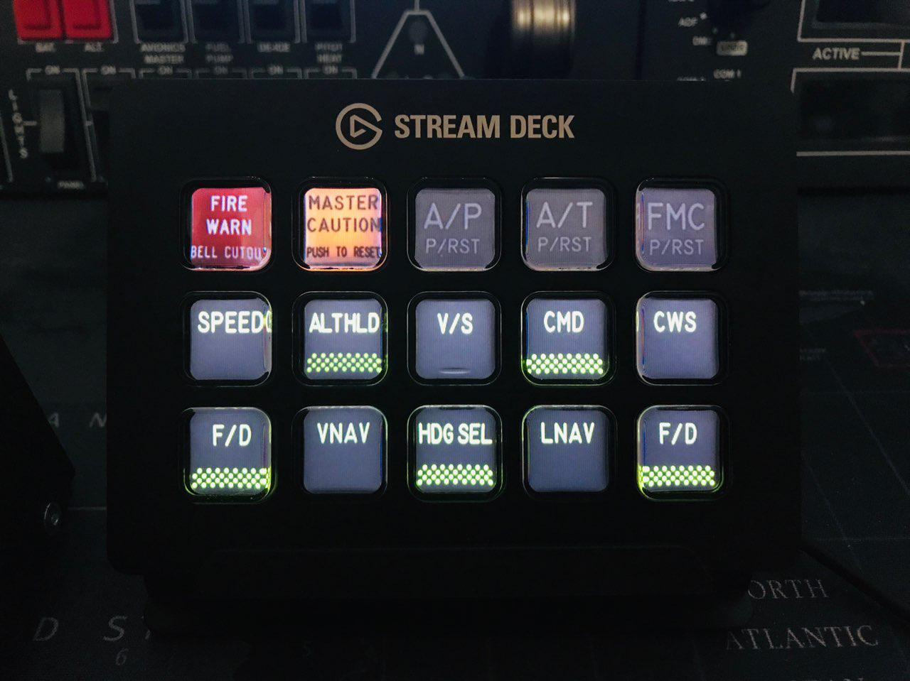

# xplanel

A simple script in python 3 that makes the Elegato Stream Deck device "smart" connected with X-Plane 11. With this script you can dynamically assign a button of the deck to a button/function of an aircraft cockpit. 
X-Plane "datarefs" are used in order to get the statuses and update the buttons according to them, "commands" are used to send the deck buttons input to X-Plane. So all this explanation to say that the communication is bi-directional. The communication between the script and X-Plane is by UDP, that is native in the simulator so no plugins to be installed.

Two important libraries are used: pyXPUDPServer (leleopard) and Python Stream Deck (abcminiuser)
In order to make it working you have to install these libraries.

The script reads a config.json file and the images from a specified folder, I'll make it easy to understand with an example:

We want to put the "Master Caution" button to the second button/first raw of the Steam Deck, so firstly we have to create two images for the master caution button, one for the "ON" state and the other for the "OFF" state.

<table>
<tr><td>1.mc.on.png</td><td>1.mc.off.png</td></tr>
<tr><td></td><td></td></tr>
</table>

The file name is important and contains three dot separated informations: 
<table>
<tr><td colspan="4" align="center" >1.mc.on.png</td></tr>
<tr><td>1</td><td>mc</td><td>on</td><td>png</td></tr>
<tr><td>The position of the button, It's zero based, so the first one in the first raw is the number 0, the last one in the third row is the number 14</td><td>this is a name reference to the button, will be reported in the config.json</td><td>on/off for the two states</td><td>image extension, could be png or jpeg</td></tr></table>

So what if we want to put the "Master Caution" in the last button of our stream deck, we have to change the name files to 14.mc.on.png and 14.mc.off.png , I think it's pretty easy, isn't it?

OK after we created the images we have to put them in a defined folder created on the same level of the script. In this case a folder named "737800". After that we have to make some changes to the config.json.
```
{
  "MAIN": {
    "XPLANE_IP": "127.0.0.1",
    "XPLANE_PORT": 49000,
    "SERVER_IP": "127.0.0.1",
    "SERVER_PORT": 49008,
	  "SELECTED_AIRCRAFT": "B738"
  },
  "B738": {
    "imgfolder": "737800/",
    "drefcmds": [
        {
            "dataref": "laminar/B738/annunciator/master_caution_light",
            "command": "laminar/B738/push_button/master_caution1",
            "imgrefn": "mc"
        }
	]
  }
}
```
It's self-explanatory but we can say something about it as well, the first part "MAIN" is needed to the script to work correctly, since we work through the UDP, you can use this script also on another pc put in the same network, in that case you have to change the  XPLANE_IP and SERVER_IP accordly, if you're planning to use it on the same pc you do not need to change anything till "SELECTED_AIRCRAFT", which is the reference to the settings for the aircraft written below, in this case "B738".

The aicraft settings need:
- "imgfolder" path, the folder which contains our ON/OFF "Master Caution" images.
- "dataref" string, the X-PLane aircraft dataref related to the status we want report to the button, in this case is reported the one of the ZIBO 737 "Master Caution"
- "command" string, the X-PLane aircraft command related to the function we want assign to the button, in this case is reported the one of the ZIBO 737 "Master Caution"
- "imgrefn" name, in this case "mc", the same one used in the ON/OFF images for "Master Caution"

After set that, all we have to do is running the script (Please note that)

That's all!

The uploaded script in the repository has all functions displayed in the first image and works for the ZIBO 737 aicraft.
In ordwr to make it working with another 737 aicraft you have to change all datarefs and commands reported in the config.json.
It's something in alpha stage and I have to say that this script is provided "AS IS", without warranty of any kind.

I had a fun making this, hope you'll enjoy it! Happy Flying!

--It's the first time I use Python and GitHub so please understand me for any kind of errors I've made!--


